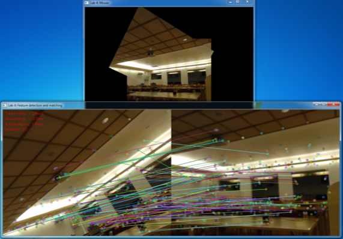

# Image mosaics from feature matching

Welcome to this lab in the computer vision course [TEK5030] at the University of Oslo.

In this lab we will experiment with feature detection and matching to extract point correspondences between two images. 
We will then use these correspondences to estimate a homography between the images, which will enable us to create a live video mosaic!

**Start** by cloning this repository on your machine. 

Then, open the project in PyCharm.
If you are uncertain about how this is done, please take a look at [the intro lab].

The lab is carried out by following these steps:

1. [Get an overview](lab-guide/1-get-an-overview.md)
2. [Features in OpenCV](lab-guide/2-features-in-opencv.md)
3. [Experiment with feature matching](lab-guide/3-experiment-with-feature-matching.md)
4. [Homography estimation](lab-guide/4-homography-estimation.md)
5. [Creating an image mosaic](lab-guide/5-creating-an-image-mosaic.md) 

Please start the lab by going to the [first step](lab-guide/1-get-an-overview.md).

[TEK5030]: https://www.uio.no/studier/emner/matnat/its/TEK5030/
[the intro lab]: https://github.com/tek5030/lab-intro/blob/master/py/lab-guide/1-open-project-in-pycharm.md