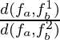

# Step 3: Experiment with feature matching
First, lets play around with feature matching!

## 1. Experiment with blob and corner feature detectors
Lets first try to run the code. 
You should see a video stream with detected keypoints.

What kind of detector are you currently using? 
Is this a blob- or corner detector? 
Try the other kind, and see what happens!

## 2. Implement the ratio test
In order to get robust matches, we will now implement the ratio test.

Remember from the lectures that we can compute the nearest neighbor distance ratio by computing

where *f*b1 is the best match, and *f*b2 is the second best match to feature *f*a in image *a*.

Take a look at the function `extract_good_ratio_matches()` in [lab_mosaic.py](../lab_mosaic.py).
Use the inputs `matches` and `max_ratio` to perform the ratio test, and return only the (best) matches that passes this test.

When your implementation seems reasonable, compile and run the program. 
Press *\<space\>* to set the current frame to the reference frame. 
You should now see results from matching the next current frames with the reference. 
Does your implementation still look reasonable?

## 3. Experiment with feature matching
Now that you have a working feature matching system, play around with different detectors and descriptors from the [features2d](https://docs.opencv.org/4.5.5/da/d9b/group__features2d.html) and [xfeatures2d](https://docs.opencv.org/4.5.5/d1/db4/group__xfeatures2d.html) modules in OpenCV. 
Which methods are faster and which methods are more robust?

In the [next part](4-homography-estimation.md), we will use this feature matching system to compute the transformation between the reference frame and the current frames.
