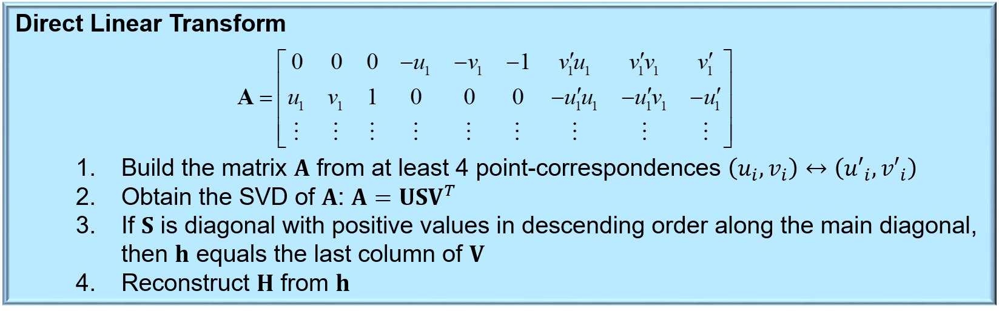
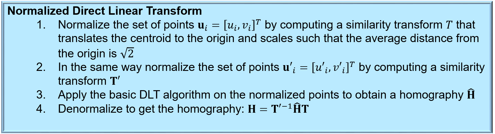
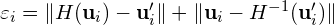
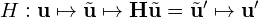
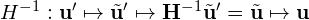

# Step 4: Homography estimation
Recall from the lectures that we can estimate a homography between two images from point correspondences using the Direct Linear Transform:

We can often achieve a better result if we perform the estimation on normalized point correspondences, using the Normalized DLT:

## 4. Understand how we estimate the homography
Lets take a look at how we have implemented all this math! 
Go to the class `HomographyEstimator` in [lab_mosaic.py](../lab_mosaic.py):

- Look at `HomographyEstimator._dlt_estimator()`:
  - Try to identify steps 1-4 in the DLT above.
- Look at `HomographyEstimator._normalized_dlt_estimator()`:
  - Try to identify steps 1-3 in the normalized DLT above.
  - What does the normalizing similarity do?
- Look at `HomographyEstimator._ransac_estimator()`:
  - How many point correspondences do we sample each iteration of the RANSAC loop? Why?
  - Which homography estimation algorithm do we use in the RANSAC loop? DLT or normalized DLT? Why not the other one?
- Look at `HomographyEstimator.estimate()`:
  - This method returns a `HomographyEstimate`. What is that? (Hint: Check [common_lab_utils.py](../common_lab_utils.py))

## 5. Compute the reprojection error
To make the homography estimator work, we need to finish `HomographyEstimator._compute_reprojection_error()` in order to compute the *reprojection error* in the RANSAC inlier test.

In this context, reprojection error is a measure of how well a homography fits with a correspondence **u***i* &leftrightarrow; **u***i*`:

Here, *H* maps pixels from one image to the other according to

and *H*-1 is its inverse:

In `HomographyEstimator._compute_reprojection_error()` you need to compute the reprojection error for a point correspondence. 

Hint: You can use the functions `homogeneous()` and `hnormalized()` in [common_lab_utils.py](../common_lab_utils.py)

When you are happy with your implementation, run the program. 
Choose a reference and perform matching by pressing *<space>*. 
Use debugging tools or printouts to the console to check that your implementation computes reasonable results.

Now, lets use the computed homography to combine the current frame with the reference in an image mosaic!
Please continue to the [next step](5-creating-an-image-mosaic.md).
